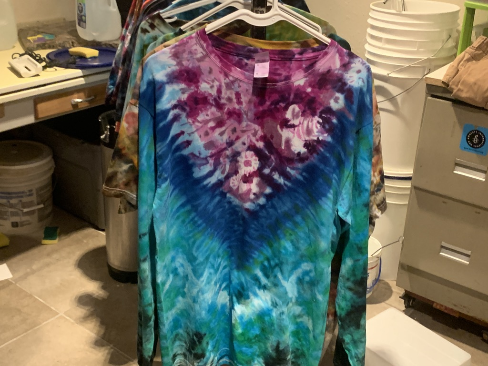

I teach environmental science, engineering, geospatial technologies, and
mathematics at Oglala Lakota College on the Pine Ridge Reservation, where I've
been on the faculty since 2005. I'm a hydrologist by training—geological
engineering (BS), water resources (MS), and civil & environmental engineering
(PhD, South Dakota School of Mines)—with dissertation research on hydrologic and
ecological drought in the semi-arid Northern Great Plains.

My work sits at the intersection of water, data, and education. Over the past
two decades I've helped build NSF-funded STEM and pre-engineering pathways at
tribal colleges, authored watershed protection plans with the Oglala Sioux
Tribe's Environmental Protection Program, and developed environmental data
science programs that combine geospatial analysis, reproducible research, and
open-source software. Increasingly, I'm exploring how AI-assisted workflows,
cloud computing, and cyberinfrastructure can expand access to research while
respecting Indigenous data sovereignty and community priorities.

My approach is systems-oriented, place-based, and collaborative. I work with
students, faculty, tribal programs, and research partners to connect technical
methods with local knowledge and community needs—which means thinking carefully
about who controls data, who benefits from its use, and how open-science
practices can support, rather than override, tribal data governance.

## Research & Professional Interests

- Watershed hydrology in the Northern Great Plains—drought, flood frequency,
  intermittent streams, and semi-arid systems _most recent project:_
  [FFA_regional-skew](https://github.com/cjtinant/FFA_regional-skew)
- Environmental data science, GIS, and remote sensing—geospatial analytics and
  spatial data infrastructure
- Indigenous data sovereignty—CARE, FAIR, and community-centered data governance
- Open, reproducible workflows in R, Python, and GitHub—including turning
  one-off research scripts into documented, reusable software, most recently an
  [audio transcription pipeline](https://github.com/cjtinant/audio-transcription-pipeline)
  using WhisperX and pyannote
- Practical applications of AI and machine learning in research, teaching, and
  scientific workflows
- Cyberinfrastructure for tribal colleges—cloud computing, NAIRR, CASC, and
  distributed research environments
- Place-based STEM education and open educational resources grounded in
  community priorities across the Northern Great Plains
- Mentoring others into engineering, environmental science, computing, and
  research careers—and building equitable partnerships among tribal colleges,
  universities, agencies, and cyberinfrastructure providers

## What You Will Find Here

This site, and the repositories behind it, are where I teach, prototype, and
share community-facing work. Many projects begin as practical
solutions—automating an analysis, documenting a workflow, making environmental
data easier to use—and gradually evolve into reusable tools for students,
collaborators, and other educators. Everything here is rapidly evolving: over
the next few months I'll be moving several private repos into public view,
prioritizing lesson plans from courses I've taught, so others can fork and
improve them to meet their own goals.

## Working Philosophy

I enjoy building things that are useful, understandable, and maintainable.
Whether I'm writing code, designing curriculum, or developing research
workflows, the goal is _subtraction_: reduce unnecessary complexity so others
can build on the work—and so it stays useful long after the original project has
ended. There's a Zen quality to engineering done well—keeping a beginner's mind,
giving full attention to the task at hand, and staying with the circle of
creation by letting go of a design the evidence has outgrown.

I think about knowledge the way constructivists do, and I update it the way
Bayesians do. People don't receive understanding; they grow it from experience
and reflection—so my courses and tools are scaffolds for building, not
deliveries. And nothing I make is final: every model, lesson, and workflow is a
prior, stated as clearly as I can manage, waiting to be revised by evidence.
Robust design spirals rather than marches—through tinkering and reflection,
active and passive modes, explicit models and the implicit knowledge that an
attuned practice builds.

Good engineering begins with listening, because the most important priors are
held in relationship. Twenty years at Oglala Lakota College have taught me what
Lakota philosophy holds at its center—Tákuškaŋškaŋ, the energy that moves and
interconnects all living beings, Mitákuye. Knowledge behaves the same way: it
doesn't sit still, it moves through long-term relationships with the land,
communities, educators, practitioners, and students who understand the
landscapes, histories, and priorities of the places where the work happens.
Macrosystems ecology says something similar in its own dialect—nothing exists at
one scale, and what matters moves across them. A stream gauge is nested in a
watershed, a watershed in a climate system; a classroom in an institution, an
institution in a policy environment. Durable solutions respect both the nesting
and the relations.

## Collaboration

I welcome collaboration on environmental data tools, hydrologic research,
geospatial science, tribal-college STEM education, Indigenous data governance,
and AI-assisted scientific workflows—and I'm always glad to share ideas with
educators building reproducible, locally relevant data-science curricula and
open educational resources. And, **most of all**, I welcome collaboration on fun
and interesting projects that serve no purpose other than to _spark joy_.

## Beyond Work

Outside the classroom and the lab, I enjoy hands-on craft traditions: textile
dyeing and batik, woodworking, musical instrument building, essential oil
blending, and other bespoke work that rewards careful observation,
experimentation, and iteration. _The next stop in turning ideas into objects:_
_putting a small blacksmithing forge to use._ Those same habits shape how I
approach teaching, software, and research.

